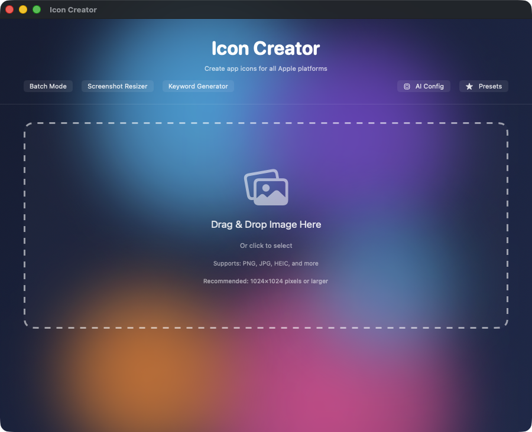

# Icon Creator v2.6.0

<<<<<<< Updated upstream


**Professional app icon generator with AI-powered design and voice capabilities**
||||||| Stash base
**Professional app icon generator with AI-powered design and voice capabilities**
=======
**Professional app icon generator with AI-powered design, voice capabilities, and WidgetKit integration**
>>>>>>> Stashed changes

Generate complete icon sets for iOS, macOS, watchOS, and web platforms with AI assistance, batch processing, and macOS widgets.

---




## What is Icon Creator?

Icon Creator is a native macOS application for generating professional app icon sets from a single source image. It handles all required sizes for Apple platforms (iOS, macOS, watchOS, tvOS) and web platforms, with AI-powered design assistance and voice features for accessibility.

**Key Benefits:**
- **Complete Icon Sets**: All sizes for all Apple platforms
- **Batch Processing**: Generate hundreds of icons in seconds
- **AI Design Assistant**: Smart cropping and composition suggestions
- **Voice Capabilities (v1.1.0)**: Audio feedback and voice control
- **Analysis Features (v1.1.0)**: AI-powered design analysis

**Perfect For:**
- **App Developers**: Generate all required icon sizes
- **Designers**: Quick icon set creation
- **Indie Developers**: Professional icons without design skills
- **Accessibility**: Voice-guided icon creation

---

## What's New in v2.6.0 (February 2026)

### WidgetKit Integration
**macOS Notification Center widgets for quick access:**

- **Small Widget**: Quick create from last image, recent project access
- **Medium Widget**: Recent projects list, generation status, quick create
- **Large Widget**: Full dashboard with presets, projects, and status

**Widget Features:**
- **Recent Projects**: View and open recent icon generation projects
- **Generation Status**: Real-time progress during icon generation
- **Quick Create**: One-tap icon creation from last used image
- **Preset Shortcuts**: Quick access to favorite presets (Minimalist, Full Bleed, Rounded, etc.)
- **Deep Linking**: Tap to open specific projects or start new generations

**App Group Data Sharing:**
- Uses `group.com.jkoch.iconcreator` for data sync
- Automatic widget timeline updates on project changes
- Thumbnail generation for project previews

**Usage:**
1. Build and run Icon Creator
2. Add widget from Notification Center (Edit Widgets)
3. Choose Small, Medium, or Large size
4. Widget shows recent projects and quick actions

---

## What's New in v1.1.0 (January 2026)

### 🎙️ Voice Capabilities
**macOS speech synthesis integration:**

- **Text-to-Speech**: Describe icons using NSSpeechSynthesizer
- **Audio Briefings**: Generate audio summaries of icon sets
- **Voice Selection**: Support for all macOS system voices
- **AIFF (Audio Interchange File Format) Output**: Standard audio format for compatibility
- **Async Processing**: Non-blocking speech synthesis
- **Memory Safe**: Proper temporary file cleanup

**Usage:**
```swift
let voice = VoiceCapabilities()
let audioData = try await voice.synthesizeSpeech(text: "Icon set complete: 47 images generated", voice: nil)
```

### 🧠 Analysis Capabilities
**AI-powered design analysis:**

- **Summarization**: Summarize icon design elements
- **Fact Checking**: Verify design claims and specifications
- **Bias Detection**: Analyze for cultural/accessibility bias
- **Sentiment Analysis**: Classify icon mood and tone
- **Ollama Integration**: Routes to existing AI backend
- **Specialized Prompts**: Optimized for design analysis

**Usage:**
```swift
let analysis = AnalysisCapabilities()
let summary = try await analysis.summarize("Icon design with blue gradient and modern aesthetic")
let sentiment = try await analysis.analyzeSentiment("Professional corporate icon set")
```

---

## Features

### Icon Generation
- **All Apple Platforms**: iOS, macOS, watchOS, tvOS icon sizes
- **Web Platforms**: PWA (Progressive Web App), favicon, social media sizes
- **Custom Sizes**: Generate any custom dimensions
- **Batch Export**: All sizes in one click
- **Format Support**: PNG (Portable Network Graphics), ICNS (Icon Suite), ICO (Windows)
- **High Quality**: Bicubic interpolation for resizing

### AI-Powered Features
- **Smart Cropping**: Vision framework face/object detection
- **Composition Analysis**: AI-powered design feedback
- **Color Palette**: Extract dominant colors
- **Voice Capabilities (v1.1.0)**: TTS (Text-to-Speech) and audio briefings
- **Analysis Tools (v1.1.0)**: Summarize, fact-check, detect bias, sentiment
- **Design Suggestions**: AI recommendations for improvements

### Processing Features
- **Alpha Channel**: Preserve transparency
- **Corner Radius**: Automatic iOS rounded corners
- **Shadow Effects**: Optional drop shadows
- **Color Adjustments**: Brightness, contrast, saturation
- **Image Filters**: Apply Core Image filters
- **Batch Processing**: Process multiple source images

### Export Options
- **Single File Export**: Individual icon files
- **Asset Catalog**: Xcode .xcassets bundle
- **Zip Archive**: All icons packaged
- **Folder Structure**: Organized by platform
- **Naming Conventions**: Platform-specific names
- **Manifest Files**: JSON with metadata

---

## Security

### Privacy & Data Protection
- **Local Processing**: All image processing on your Mac
- **No Cloud Upload**: Images never uploaded
- **No Telemetry**: Zero analytics or tracking
- **Sandboxed**: App runs in macOS sandbox
- **File Permissions**: Only accesses user-selected files

### AI Processing
- **Local AI**: Voice and analysis use local Ollama/MLX (Machine Learning eXtensions)
- **No Cloud Required**: Can run completely offline
- **Ethical Guardian**: Content monitoring prevents misuse
- **Audit Logging**: All operations logged

---

## Requirements

### System Requirements
- **macOS 13.0 (Ventura) or later**
- **Architecture**: Universal (Apple Silicon recommended)

### For AI Features
- **Ollama**: `brew install ollama` (for analysis)
- **MLX**: `pip install mlx-lm` (Apple Silicon only)

### Dependencies
**Built-in:**
- SwiftUI, AppKit, CoreImage, Vision

**Optional:**
- Ollama (for AI analysis)
- mlx-lm (for MLX AI)

---

## Installation

### Pre-built Binary

```bash
open "/Volumes/Data/xcode/binaries/20260127-IconCreator-v1.1.0/IconCreator-v1.1.0-build2.dmg"
```

### Build from Source

```bash
git clone https://github.com/kochj23/icon-creator.git
cd icon-creator
open "Icon Creator.xcodeproj"
```

---

## Usage

### Generate Icon Set

1. **Launch Icon Creator**
2. **Select source image** (PNG, JPEG, or other format)
3. **Choose platforms** (iOS, macOS, watchOS, tvOS, web)
4. **Click "Generate"**
5. **Save to location**

### Use Voice Features

**Generate Audio Description:**
1. Select generated icon set
2. Tools → Generate Audio Briefing
3. Audio file saved with icon set

### AI Analysis

**Analyze Design:**
1. Select icon
2. Tools → Analyze Design
3. View AI-generated feedback

**Check Bias:**
1. Select icon
2. Tools → Detect Bias
3. Review accessibility recommendations

---

## Troubleshooting

**Image Quality Poor:**
- Use high-resolution source (1024×1024 minimum)
- Ensure PNG with transparency
- Check source image quality

**Export Fails:**
- Verify disk space available
- Check write permissions on destination
- Try exporting smaller set first

**Voice Features Not Working:**
- macOS speech synthesis built-in (no setup needed)
- Check audio output device
- Verify System Settings → Sound

---

## Version History

### v2.6.0 (February 2026)
- WidgetKit integration with Small, Medium, Large widgets
- Recent projects widget view
- Generation status in real-time
- Quick create from last image
- Preset shortcuts from widget
- App Group data sharing (group.com.jkoch.iconcreator)
- Deep linking support (iconcreator:// URL scheme)

### v1.1.0 (January 2026)
- Voice capabilities with NSSpeechSynthesizer
- Analysis capabilities (summarize, fact-check, bias, sentiment)
- SecurityCapabilities removed per security policy

### v1.0.0 (2025)
- Initial release
- Icon generation for all platforms
- Smart cropping with Vision
- Batch export

---

## License

MIT License - Copyright © 2026 Jordan Koch

---

<<<<<<< Updated upstream
**Last Updated:** January 27, 2026
**Status:** ✅ Production Ready

---

## More Apps by Jordan Koch

| App | Description |
|-----|-------------|
| [ExcelExplorer](https://github.com/kochj23/ExcelExplorer) | Native macOS Excel/CSV file viewer |
| [TopGUI](https://github.com/kochj23/TopGUI) | macOS system monitor with real-time metrics |
| [RsyncGUI](https://github.com/kochj23/RsyncGUI) | Native macOS GUI for rsync file synchronization |
| [MBox-Explorer](https://github.com/kochj23/MBox-Explorer) | macOS mbox email archive viewer |
| [MLXCode](https://github.com/kochj23/MLXCode) | Local AI coding assistant for Apple Silicon |

> **[View all projects](https://github.com/kochj23?tab=repositories)**

---

> **Disclaimer:** This is a personal project created on my own time. It is not affiliated with, endorsed by, or representative of my employer.
||||||| Stash base
**Last Updated:** January 27, 2026
**Status:** ✅ Production Ready
=======
**Last Updated:** February 4, 2026
**Status:** Production Ready
>>>>>>> Stashed changes

## Nova / Claude API Integration

This app exposes a local HTTP API on port **37435** for integration with [Nova](https://github.com/kochj23) (OpenClaw AI) and Claude Code.

**Platform:** macOS  
**Auth:** None (loopback only — macOS apps bind to 127.0.0.1)

### Standard Endpoints

```bash
curl http://127.0.0.1:37435/api/status   # App status + uptime
curl http://127.0.0.1:37435/api/ping     # Health check
```

### App-Specific Endpoints

```
/api/status
/api/ping
```

### Usage Example

```bash
# Check if running
curl -s http://127.0.0.1:37435/api/status | python3 -m json.tool

# From Nova (OpenClaw TUI)
# Nova has this pre-authorized and will use these endpoints automatically
```

The API server starts automatically when the app launches and binds to loopback only — no external network exposure.

