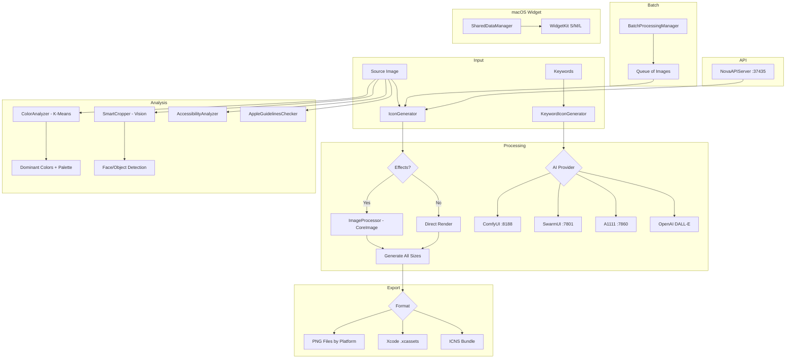
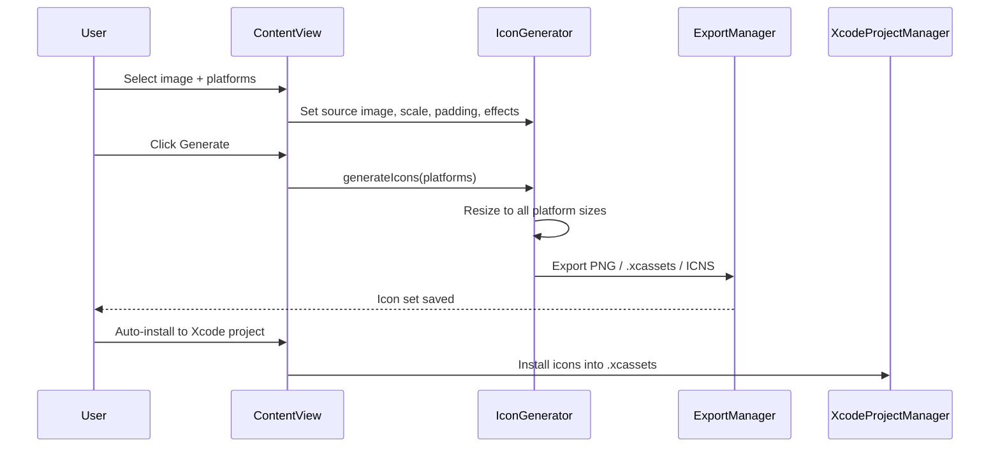

# Icon Creator


[](LICENSE)


**App icon generator for all Apple platforms with AI-powered keyword generation, batch processing, and color analysis.**

Icon Creator generates complete icon sets from a single source image for iOS, macOS, watchOS, tvOS, iMessage, and Mac Catalyst. It also supports AI-driven icon generation from text keywords via SwarmUI, ComfyUI, Automatic1111, or OpenAI DALL-E.

Written by Jordan Koch.

---

## Architecture



### Export Flow



---

## Features

### Icon Generation

| Feature | Details |
|---|---|
| Platforms | iOS, macOS, watchOS, tvOS, iMessage, Mac Catalyst |
| Formats | PNG, ICNS, Xcode .xcassets |
| Scaling | Configurable 0.5x-2.0x with bicubic interpolation |
| Padding | 0-30% adjustable |
| Background color | Custom background behind icon |
| Auto-crop | Crop non-square images to square |
| Image effects | Brightness, contrast, saturation, Core Image filters |
| Corner radius | Automatic iOS rounded corners |
| Shadow effects | Optional drop shadow |

### AI Keyword Generation

Generate icons from text descriptions using local or cloud image generation backends.

| Provider | Port | Notes |
|---|---|---|
| ComfyUI | 8188 | Node-based workflows |
| SwarmUI | 7801 | Flux models |
| Automatic1111 | 7860 | Stable Diffusion WebUI |
| OpenAI DALL-E | -- | Cloud, API key required |

Configurable variants, size, and style. Inspired by [VibeScape](https://github.com/jasonacox/VibeScape) by Jason Cox.

### Batch Processing

Queue multiple source images with per-item platform and settings. Process entire queues sequentially with progress tracking.

### Color Analysis

K-means clustering extracts dominant colors from source images and generates a complete color palette with primary, secondary, accent, and background color suggestions.

### Smart Cropping

Vision framework face and object detection for intelligent crop positioning.

### Presets

Save and load icon generation presets (Minimalist, Full Bleed, Rounded, etc.) for consistent settings across projects.

### Xcode Project Integration

Scan for local Xcode projects, detect target platforms, and install generated icons directly into .xcassets bundles.

### Screenshot Resizer

Resize screenshots to App Store submission sizes.

### Apple Guidelines Checker

Validate icons against Apple's Human Interface Guidelines.

### Accessibility Analyzer

Check icon contrast, readability, and accessibility compliance.

### macOS Widget (WidgetKit)

| Size | Content |
|---|---|
| Small | Quick create from last image, recent project |
| Medium | Recent projects list, generation status |
| Large | Dashboard with presets, projects, and status |

Data syncs via App Group `group.com.jkoch.iconcreator`.

### Nova API Server

Local HTTP API on port **37435** (loopback only).

```bash
curl http://127.0.0.1:37435/api/status
curl http://127.0.0.1:37435/api/ping
```

---

## Requirements

- macOS 13.0 (Ventura) or later
- Universal binary (Apple Silicon recommended)
- For AI keyword generation: ComfyUI, SwarmUI, A1111, or OpenAI API key

## Installation

### From DMG

Download from [Releases](https://github.com/kochj23/icon-creator/releases), open the DMG, drag to Applications.

### From Source

```bash
git clone git@github.com:kochj23/icon-creator.git
cd "Icon Creator"
open "Icon Creator.xcodeproj"
# Build: Cmd+R
```

---

## Usage

1. Launch Icon Creator
2. Select source image (PNG, JPEG, or drag-and-drop)
3. Choose target platforms (iOS, macOS, watchOS, tvOS, iMessage)
4. Adjust scale, padding, background color, and effects
5. Click Generate
6. Export to folder, .xcassets, or ICNS

### Keyword Mode

1. Switch to Keyword Generator mode in toolbar
2. Enter descriptive keywords for the icon you want
3. Select AI provider (ComfyUI, SwarmUI, A1111, DALL-E)
4. Generate variants
5. Export chosen result

### Batch Mode

1. Enable Batch Mode in toolbar
2. Add multiple source images to the queue
3. Configure per-item platforms and settings
4. Process queue

---

## Test Suite

154 tests covering platform sizes, icon settings, color components, image effects, icon generation, export, error handling, keyword generation, and security.

```bash
xcodebuild -scheme "Icon Creator" -destination "platform=macOS" test
```

| Category | Tests | Description |
|---|---|---|
| Platform | 12 | Icon sizes, idioms, folder names for all platforms |
| IconSettings | 4 | Validation, codable, equatable, defaults |
| ColorComponents | 4 | Init, codable, NSColor conversion |
| ImageEffects | 2 | Defaults, codable round-trip |
| IconGenerator | 14 | Settings, clamping, validation, export, caching |
| ContentsJSON | 3 | Init, add image, JSON encoding |
| Error Handling | 4 | All error types have descriptions |
| KeywordGenerator | 5 | Providers, categories, filenames |
| Security | 5 | API keys, localhost, path traversal, PNG integrity |
| Comprehensive | 101 | Full coverage of all model and service paths |

---

## Security and Privacy

- **Local processing** -- all image manipulation on your Mac
- **No telemetry** -- zero analytics or tracking
- **Keychain storage** -- API keys in macOS Keychain
- **Ethical AI Guardian** -- content moderation on AI-generated imagery
- **Loopback-only API** -- Nova server binds to 127.0.0.1

---

## License

MIT License -- Copyright 2026 Jordan Koch

See [LICENSE](LICENSE) for the full text.

---

Written by Jordan Koch ([@kochj23](https://github.com/kochj23))
